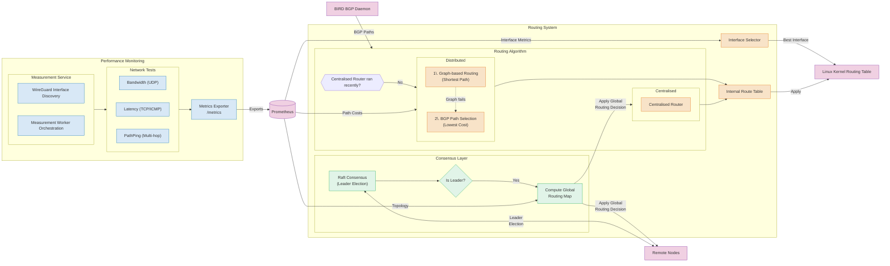

```mermaid
flowchart LR
    %% External systems
    BIRD["BIRD BGP Daemon"]:::external
    KernelRT["Linux Kernel Routing Table"]:::external
    Prom[("Prometheus")]:::external
    RemoteNodes["Remote Nodes"]:::external

    %% Main sections with clear separation
    subgraph MON["Performance Monitoring"]
        subgraph MService["Measurement Service"]
            direction LR
            WG["WireGuard Interface Discovery"]:::monitoring
            WO["Measurement Worker Orchestration"]:::monitoring
        end
        
        subgraph Tests["Network Tests"]
            direction LR
            BW["Bandwidth (UDP)"]:::monitoring
            Lat["Latency (TCP/ICMP)"]:::monitoring
            PP["PathPing (Multi-hop)"]:::monitoring
        end
        
        MetricsExporter["Metrics Exporter<br>/metrics"]:::monitoring
    end
    
    subgraph ROUTE["Routing System"]
        direction LR
        InterfaceSelector["Interface Selector"]:::interface

        subgraph CON["Consensus Layer"]
            direction LR
            RaftConsensus["Raft Consensus <br>(Leader Election)"]:::consensus
            IsLeader{"Is Leader?"}:::consensus
            CentralRouter["Compute Global<br>Routing Map"]:::consensus
        
            RaftConsensus --> IsLeader
            IsLeader -->|"Yes"| CentralRouter
        end

        subgraph ALGO["Routing Algorithm"]

            RoutingDecision{{"Centralised Router ran recently?"}}
            RoutingDecision -->|No| RI
            

            subgraph CR["Centralised"]
                CentralRT["Centralised Router"]:::routing
            end
            
            subgraph RI["Distributed"]
                direction TB
                S1["1\. Graph-based Routing <br>(Shortest Path)"]:::routing
                S2["2\. BGP Path Selection <br>(Lowest Cost)"]:::routing
                
                S1 -.->|"Graph fails"| S2
            end
        end

        RouteTable["Internal Route Table"]:::routing

    end
    MService --> Tests
    Tests --> MetricsExporter
    MetricsExporter -->|"Exports"| Prom
    Prom ------>|"Interface Metrics"| InterfaceSelector
    InterfaceSelector -->|"Best Interface"| KernelRT
    BIRD -->|"BGP Paths"| ALGO
    Prom -->|"Path Costs"| RI
    RI --> RouteTable
    CR --> RouteTable
    RouteTable -->|"Apply"| KernelRT
    Prom -->|"Topology"| CentralRouter

    ALGO ~~~ 
    
    CentralRouter --> |"Apply Global<br>Routing Decision"| CR
    CentralRouter -->|"Apply Global<br>Routing Decision"| RemoteNodes
    RaftConsensus <-->|"Leader <br>Election"| RemoteNodes
    
    %% Styling
    classDef monitoring fill:#d8e8f6,stroke:#2980b9,stroke-width:1px
    classDef routing fill:#f8e3c8,stroke:#e67e22,stroke-width:1px
    classDef consensus fill:#e1f4e8,stroke:#27ae60,stroke-width:1px
    classDef external fill:#f0d0e2,stroke:#8e44ad,stroke-width:1px
    classDef interface fill:#f8e3c8,stroke:#e67e22,stroke-width:1px
```